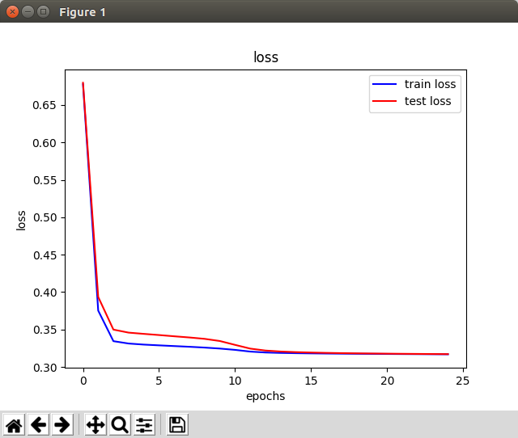
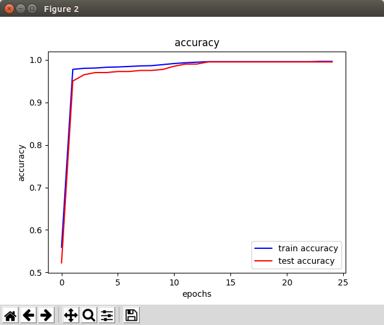

Тестовое задание : классификация изображений
===

Нужно отличать фотографий на которых изображена одежда от остальных

Класс 1 - одежда, класс 0 - другое

Как было реализовано:
---

Нахождение датасета было самым сложным. Для одежды был использован датасет DeepFashion (но это не точно).
Для остальных - был у меня один датасет с разными изображениями.
1000 изображений с одеждой, 1000 без.

Написано на Python 3, используемые библиотеки pytorch, numpy, matplotlib, sklearn.

Графики точности и ошибки представлены ниже. Точность слишком высокая уже после 1 эпохи. Думаю, что выборка изображений плохая, поэтому так.

Как запустить?
---

Для запуска обучения и сохранения модели

`$ python main.py --train`

Для загрузки модели и расчета точности

`$ python main.py --test`
